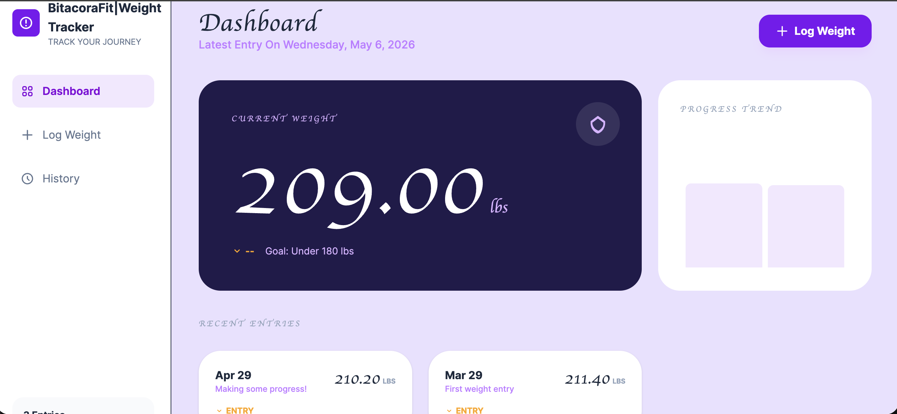
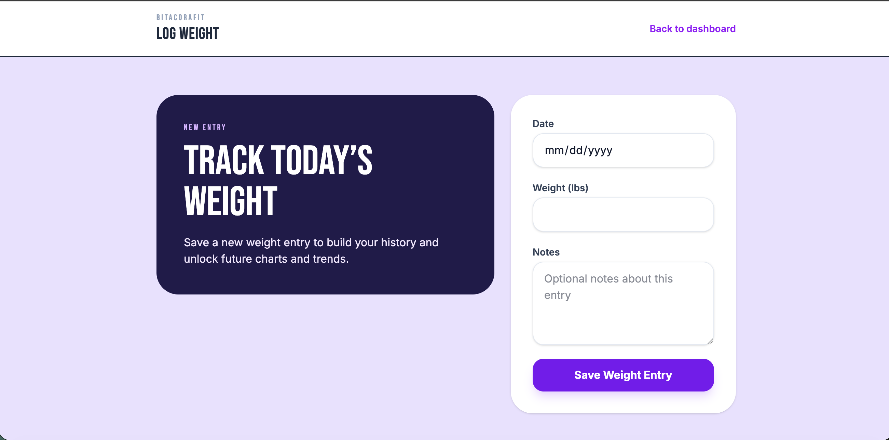
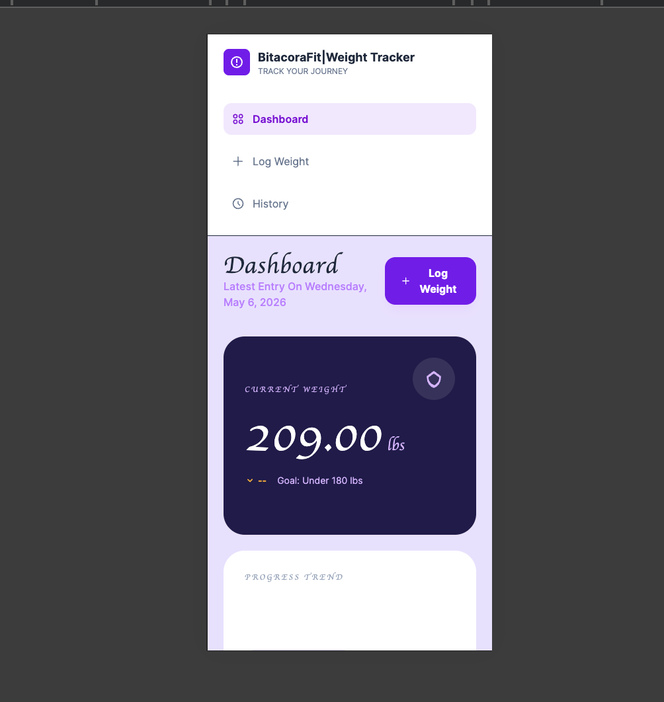
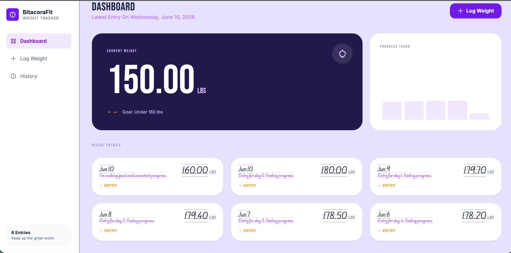
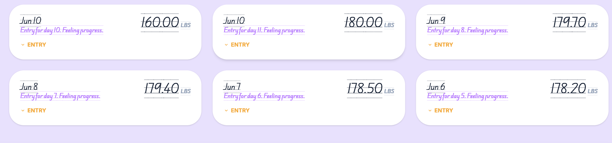

# BitacoraFit
## What BitacoraFit will be
BitacoraFit will be a reflection-first health tracking webapp focused on helping users better understand long-term progress without becoming overwhelmed by daily fluctuations.
Rather than emphasizing strict tracking or perfection, this project is meant to encourage a more sustainable and contextual approach to long-term health and weight management through trend visualization, reflections, and gradual progress awareness.

This project is currently in active development.

## MVP Scope (Planned)
The current MVP focuses on building a reflection-first weight tracking web application designed to help users track long-term progress in a calmer and more sustainable way.

The MVP is intentionally focused and iterative in order to prioritize:
- strong engineering foundations
- manageable project scope
- thoughtful product design
- real-word deployment experience
### Planned MVP Features
#### Authentication & User Accounts
- User sign up, login, and logout
- User-specific dashboards and data
#### Weight Tracking
Users will be able to:
- Create weight entries
- Edit weight entries
- Delete weight entries
- View weight history over time

Each entry may include:

- Weight value
- Date
- Optional reflections/notes

#### Reflection-Based Tracking

The MVP will support optional reflections and contextual notes to help users better understand long-term patterns and progress.

Examples may include:

- stress
- travel
- poor sleep
- lifestyle changes
- emotional reflections

#### Weight Trend Visualization

Users will be able to visualize:

- Weight history
- Long-term trends
- Progress over time

The goal is to reduce emotional overwhelm caused by normal day-to-day fluctuations.

#### Basic Progress Insights

The MVP will include simple trend-based summaries such as:

- progress over time
- long-term trend direction
- basic progress statistics

These insights will initially be rule-based rather than AI-generated.

#### Responsive Web Application

The project is being developed as a responsive web application accessible across desktop and mobile browsers.

#### Deployment

The application is planned to be publicly deployed to demonstrate:

- production readiness
- cloud deployment knowledge
- full-stack integration

### MVP Philosophy

Rather than focusing only on calorie counting or strict tracking, the MVP aims to encourage:

- progress trends over daily fluctuations
- contextual reflections
- reduced emotional overwhelm
- long-term consistency
- sustainable health tracking habits

## Future Features (Roadmap)

The following features are planned for future iterations and are intentionally outside the MVP scope.

### AI-Assisted Features
- AI-generated progress summaries
- AI-assisted reflections and insights
- Conversational logging
- Reduced-friction tracking workflows

### Expanded Health Tracking
- Fasting tracking
- Nutrition and meal tracking (Meal logging with reusable custom meals)
- Mood tracking- Hunger tracking
- Sleep tracking
- Energy tracking

### Body Measurements & Non-Scale Progress
- Body measurements tracking
- Non-scale victory tracking
- Additional progress visualizations

### Goal Tracking
- Goal weights
- Milestone tracking
- Long-term progress tracking

### Advanced Analytics
- Moving averages
- Trend smoothing
- Advanced progress analytics
- Additional data visualizations

### Menstrual Cycle Awareness

Future contextual tracking may include:

- menstrual cycle awareness
- cycle-related fluctuation tracking
- hunger and energy pattern tracking

### Accessibility & Internationalization
- Multilingual support
- English and Spanish support
- Accessibility improvements

### Mobile Experience
Dedicated mobile application
Improved mobile-first experiences

## Technical Stack
### Current / MVP Stack
#### Backend
- Django
#### Frontend
- Django Templates
- HTMX
- Tailwind CSS
#### Database
- PostgreSQL
#### Data Visualization
- Charting library for weight trend visualization
#### Deployment

Planned deployment stack:

- AWS
- Docker
- Amazon RDS

### Future / Extended Architecture

The following technologies are planned for future iterations as the project grows in complexity and feature scope.

#### API Layer
- Django REST Framework (DRF)
#### Background Tasks & Async Processing
- Celery
- Redis
#### Cloud & Storage
- Amazon S3
- Redis/ElastiCache

# Project Status

The project is currently in the early development and architecture phase.

Current development priorities include:

- defining MVP scope
- building core backend foundations
- implementing weight tracking features
- improving engineering workflow
- preparing for deployment

The project is intentionally being developed iteratively in order to balance:

- software engineering learning
- sustainable scope management
- product thinking
- and long-term maintainability.

### Visual Evolution

BitacoraFit has moved from early layout exploration to a cleaner, more focused tracking experience.

#### v1 — Early interface exploration

*Early dashboard concept with a bold sidebar, a large current-weight card, and the first pass at trend visualization.*

*Initial weight-entry flow with a split layout that separated context from data entry.*

*First history view showing recent entries as large cards with weight, notes, and date details.*

*Early trend visualization exploring how progress could be summarized over time.*

#### v2 — Refined current interface

*Refined dashboard with clearer hierarchy, improved spacing, and a more polished progress summary.*

*Current entry-list design with denser history, stronger readability, and a more mature visual system.*
